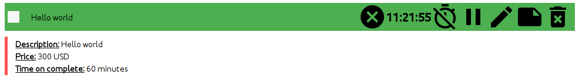
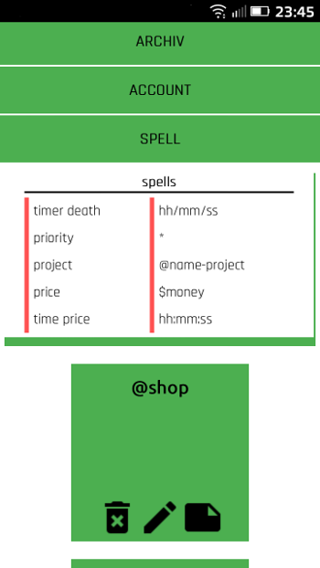

# Task Tracker
React app. Task traker with time managment. Experimental system spells.

## Install
```sh
$ cd /opt/
$ git clone https://github.com/magicwantabstract/task-tracker.git
$ cd ./task-tracker/
$ npm run start
```

## Open
http://localhost:8101

## Docs

### Spells


**Set lead time:**

```[hh]:[mm]:[ss]```

**Set price:**

```$[money]```

**Add in folder:**

```@[name_folder]```

**Priority:**
Range 1-5 stars.

```*****```

1. 
2. 
3. 
4. 
5. 

**Autocomplete:**

```[hh]/[mm]/[ss]```



## Screen

***


***

***

***

***

***

